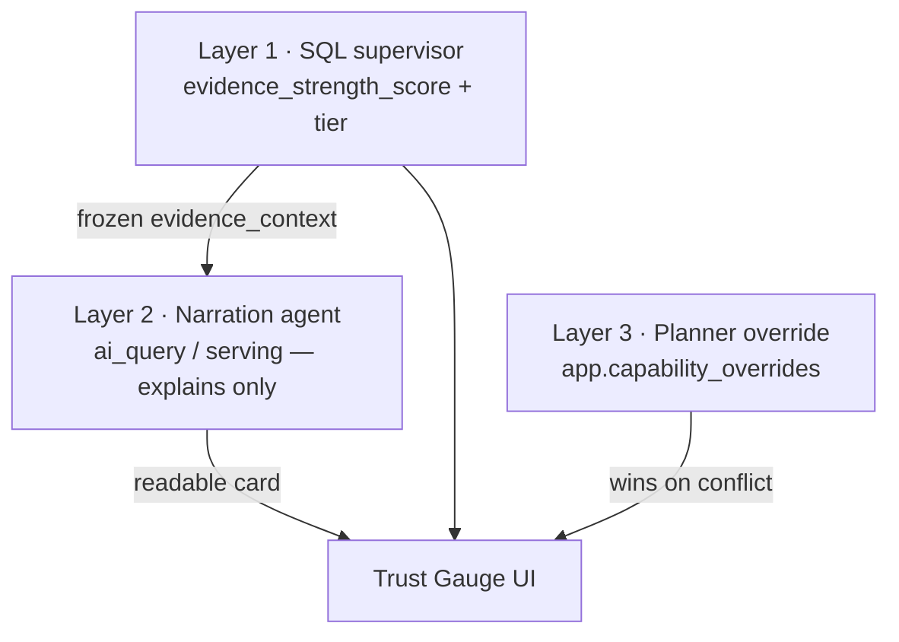
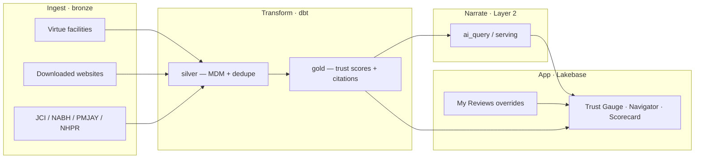

# Beyond the Hospital Directory

**Grounding Improved Patient Care**

**John Bowyer · Mason Bushyeager · Billy Houston**

**GIFT Gauge** — Governance, Integrity & Facility Trust  
**Databricks for Good hackathon in support of the Virtue Foundation — Track 1**

---

## Priya's User Story

We’re at the Databricks for Good hackathon in support of the Virtue Foundation — building for **Priya**, who runs allocation for a
nonprofit health network across India. Her job is to **place patients and steer referrals**
toward facilities that are clinically capable, cost-effective, and defensible when a district
officer or donor asks *why*.

Every morning she faces the same trap: a spreadsheet says 847 facilities in Uttar Pradesh
claim an **ICU**; a patient needs one tonight. Half those rows are duplicate entities, stale
locations, or website copy nobody verified. She’s been burned by **hospital directories** — unable
to tell if a hospital is actually equipped for the procedure or just **gaming the search
results**. Routing wrong isn’t a data-quality bug. **It’s a patient-safety failure.**

We’re here to answer one burning question that usually takes weeks of phone calls to resolve:

> **Can this hospital actually do what it claims?**

GIFT Gauge separates trustworthy capability claims from unverified ones — with the citations
attached — so planners can steer patients to the **highest-quality, most cost-effective care**
they can defend.

---

## Built on Lakehouse

**Human-in-the-loop · why we defy the AI-default**

Everyone defaults to chatbots. We treat AI as an extractor, Splink before identity guesswork,
and platform-native tooling before franken-code.

We’re not building on duct tape and prayers; we’re using the **Databricks Lakehouse** as our
foundation.

**MDM & Lakebase** — We treat our data like a product. By leveraging Lakebase architecture,
we’ve deduplicated the chaos — if a hospital exists, we know exactly where it is, its
clinical capacity, and that its accreditation is verified. Through **AgentBricks `ai_query`**,
we surface these validated insights instantly within our data layer.

**Grounded verification** — We don't take a hospital's marketing page at its word. We use
autonomous agents to crawl live sites and cross-reference that data against CMS databases and
national accreditation boards. We look for the **gap** between what they claim and what they
can prove.

**Databricks Apps & Genie** — We mashed up our **Genie BI API** with Databricks Apps to deploy
a secure, ChatGPT-powered interface. It’s a clinical navigator that’s actually read the entire
library of compliance and performance data.

---

## Tech stack: Decisions we made for ourselves

Our human-in-the-loop stack defies the AI-default on purpose:

| Decision Area | Our Human-in-the-Loop Approach | Why It Defies the AI-Default |
|---------------|--------------------------------|------------------------------|
| **AI_Classify vs. AI_Query** | We treat AI as an extractor (structured data), not a conversationalist. | Avoids hallucinated "answers" and conversational fluff; forces database-ready outputs. |
| **Batching & Model Selection** | Cost-optimized routing: simple tasks to small models, complex to "heavy" models. | Prevents model bloat and stops overspending on low-complexity routine tasks. |
| **Data Augmentation** | We use Splink for probabilistic record linkage before AI processing. | AI doesn't "guess" identities; we rely on proven statistical models to ensure data quality first. |
| **Native Platform Leverage** | We use Dabs, Genie, AI_Query, and Lakehouse FTS for everything possible. | We minimize "franken-coding" by relying on platform-native infrastructure rather than custom scripts. |

Layer 1 trust scores are computed in **SQL** (auditable, reproducible). Layer 2 narration
explains the frozen evidence — the LLM never recomputes the dial.

---

## The “30 years” problem: Call to Action

There’s a massive difference between having **30 years of experience** and having **one year
of experience repeated 30 times**. Some people just repeat their mistakes; others actually learn.

Databricks isn't just about storage — it’s how we turn that learning into a natural ontology
of decisions. We’re capturing the **why** behind the **what**, documenting which hospitals
consistently deliver quality outcomes, and scaling that expertise. We are building an ontology
that keeps humans in the loop, because algorithms don't have empathy — but they sure can help
us deploy it faster.

---

## Closing the loop

Huge thanks to **Databricks** and the **Virtue Foundation** for the platform and the partnership
to make this real. We aren't just talking about the future of care; we are building the plumbing
that makes it possible for planners to stop guessing and start steering.

The best way to change the world isn't to look for a magic solution — **it's to try.** And we
are trying.

> *If you had to pick one piece of this — the clean Lakebase foundation or the AgentBricks
> decision-making — where do you think your team would feel the biggest “relief” immediately?*

**GIFT Gauge — Governance, Integrity & Facility Trust. We turn messy claims into trustworthy
decisions.**

---

## Meet Priya — the persona behind the demo

**Priya** runs allocation for a nonprofit health network across India. Her job is not
to browse hospital websites — it is to **place patients and steer referrals** toward
facilities that are both **clinically capable** and **cost-effective**, with an audit
trail when a district officer or donor asks *why*.

Every morning she faces the same trap:

- A spreadsheet says 847 facilities in Uttar Pradesh claim an **ICU**.
- A patient needs one tonight.
- Half those rows are duplicate entities, stale locations, or self-reported website copy
  nobody has verified.
- Routing wrong is not a data-quality bug — **it is a patient-safety failure**.

GIFT Gauge is the desk Priya opens instead of the spreadsheet. She picks a
**capability** and a **region**, gets a **ranked, cited list**, drills into the
evidence, and **overrides with ground truth** when she knows better. Trust first;
allocation and referral follow.

---

## The ~5:30 demo story (presenter script)

The app ships an **interactive version of this script** — click **✨ Demo** in the top
bar (or press `g` then `d`). Full presenter notes with timings live in
[`DEMO.md`](DEMO.md). The walkthrough opens on the title slide, then walks through the
talk track and live product beats.

| When | Beat | What Priya does | What she says |
|------|------|-----------------|---------------|
| **0:00** | **Title** | Title slide | *"Beyond the Hospital Directory"* · *Grounding Improved Patient Care* |
| **0:20** | **Grit** | Immersive opener | *[beat]* ***"It's grit."*** |
| **0:45** | **Priya's User Story** | Stands on Trust Gauge landing | *"847 ICUs on a hospital directory — patient needs one tonight. Routing wrong is a **patient-safety failure**."* |
| **1:05** | **Burning question** | Hero stats | *"Can this hospital **actually** do what it claims?"* |
| **1:25** | **Intent** | Clicks **ICU**, picks a **state** | *"Capability + region. No SQL."* |
| **1:45** | **Ranked trust** | Scans the list — green / amber / red dials | *"Every claim ranked by **evidence strength**, not vibes."* |
| **2:05** | **Receipts** | Expands a **strong** facility; reads a citation | *"JCI, NABH, PMJAY — each quotes a **real source field**."* |
| **2:25** | **Human wins** | **Override assessment** → note → **My Reviews** | *"My judgment is on the record."* |
| **2:55** | **Steer care** | **Navigator** → **Scorecard** | *"Where is trustworthy capacity missing?"* |
| **3:30** | **How we score** | Immersive script | *"45% supporting ratio, 25% breadth, 30% match confidence — SQL, not vibes."* |
| **3:50** | **AI explains only** | Immersive script | *"Frozen evidence_context + rubric — the LLM never recomputes the dial."* |
| **4:05** | **Roadmap** | Immersive script | *"JCI cross-ref tightening + anomaly detection for gaming patterns."* |
| **4:20** | **Lakehouse** | Immersive tech beats | *"MDM, grounded verification, Genie — defy the AI-default."* |
| **5:08** | **Close** | Back to Trust Gauge | *"Stop guessing. Start steering. **GIFT Gauge.**"* |

```bash
databricks auth login --profile gift-india --host https://dbc-0951416d-6d0e.cloud.databricks.com
./startup.sh
# → http://localhost:8000
```

---

## How the trust score works (before the tech stack)

The in-app **✨ Demo** walkthrough covers this beat **before** the Lakehouse / tech slides.
Layer 1 is SQL; Layer 2 is narration only.

### Layer 1 — `evidence_strength_score` (auditable ranking)

Computed in `gold.capability_scored` when `claimed = true`:

| Input | Weight | What it measures |
|-------|--------|------------------|
| Supporting ratio | **45%** | `supporting_count / (supporting + contradicting)` |
| Evidence breadth | **25%** | `min(evidence_count, 5) / 5` independent items |
| Facility match confidence | **30%** | Entity-resolution confidence on name / website |
| Contradiction penalty | **×0.8 each** | Every contradicting item multiplies the total |

Unclaimed capabilities score **0.0**. Tiers: **Strong** (≥0.85) · **Moderate** (0.65–0.84) ·
**Weak** (0.45–0.64) · **Insufficient** (<0.45).

### Layer 2 — narration prompt (explains, never recomputes)

`narrate_evidence.py` passes a frozen `evidence_context` block plus the grading rubric in
`evidence_prompts.py`. The agent instruction is explicit: **use the numbers exactly as
provided**. It maps tier → planner verdict (Confirmed / Likely / Needs review / Unsupported)
and caps at **Needs review** when `contradicting_count > 0` or `trust_signal = weak_suspicious`.
Swap models — only the prose card changes.

### Where we're improving next

| Opportunity | Today | Next |
|-------------|-------|------|
| **JCI cross-referencing** | Tiered entity resolution (`exact_name_state` → `brand_city` → `brand_state`) with `match_confidence` on `gold.facility_jci` | Portal verification, accreditation **scope** per capability, richer *why JCI attached* citations |
| **Anomaly detection** | Per-facility flags: specialty mismatch, low entity confidence + claimed capability, contradicting registry rows | District-level outlier scoring — facilities fine in isolation but clustering as gaming patterns |

---

## What makes GIFT different

### 1 · Data quality & master data management

Web-scraped facility data is a **duplicate-entity problem** before it is an analytics
problem. GIFT treats MDM as first-class infrastructure:

| Problem | What we built |
|---------|---------------|
| **Same hospital, many names** | Tiered **entity resolution** in dbt — `gold.facility_jci`, `gold.facility_nabh`, `gold.facility_geography` — exact name + state → brand + city → brand + state, each with `match_confidence` |
| **Messy locations** | Gazetteer normalization in `silver_facilities_resolved` — canonical state codes, district slugs, spatial fallbacks when labels disagree |
| **Duplicate websites** | Crawl idempotency on `website_url` + `crawled_at`; one replayable history in `bronze.facility_web_crawl` |
| **Low-confidence rows** | `match_confidence < 0.70` flagged for review, not silently dropped from `gold.facilities` |

> *"Apollo Hospital, Chennai"* and *"Apollo Hospitals Enterprise Limited"* resolve to
> one `facility_id` — with the match method and confidence visible to the planner.

### 2 · Third-source integration & accreditation validation

Virtue Foundation listings are the spine. GIFT **augments** them with independent
reference sources — each landed in bronze, entity-resolved in gold, never merged
without provenance:

| Source | Role | Loader |
|--------|------|--------|
| **JCI** (Gold Seal) | International accreditation backbone → **strong** evidence | `make jci` |
| **NABH** | National accreditation / empanelment (~19k orgs) | `make nabh` |
| **PMJAY** | Public insurance empanelment signal | `make pmjay` |
| **NHPR** | National Health Provider Registry cross-check | `make nhpr` |
| **Facility websites** | First-party capability claims + verbatim evidence spans | `make crawl` |

Accreditation is not a boolean sticker — it is a **resolved crosswalk** with
`match_method`, `match_confidence`, and `source_url` so Priya can see *why* JCI or
NABH attached to this row.

### 3 · Genie BI API — ask the governed data in plain language

The Databricks AppKit stack includes the **Genie plugin** (`gift_india_web/appkit.plugins.json`)
for natural-language queries against the governed `gold.*` tables. Priya's colleagues
who live in SQL notebooks can ask *"which districts have strong ICU evidence but no
JCI-accredited hospital within 50 km?"* without writing the join themselves.

Configure via `DATABRICKS_GENIE_SPACE_ID` on the deployed app bundle.

### 4 · Search over **downloaded** evidence — not live hallucination

We **download** facility websites into a human-readable tree under `data/scraped/`
(HTML + `extracted.json` + thumbnails), land them in `bronze.facility_web_crawl`, and
only then reason over them:

- **Rule-based extraction** pulls `capability_claims` — verbatim sentences asserting ICU,
  maternity, trauma, etc. — from curated medical vocabularies on the **saved** page text.
- **Layer 2 narration** (`make narrate-pilot`) calls the model against a frozen
  `evidence_context` block built in SQL — the LLM explains what was already downloaded
  and scored; it does not invent sources.

> The planner searches **what we actually fetched**, not what a model guesses a hospital
> might have said.

---

## Better quality — decisions we made on purpose

These are the architectural bets that keep GIFT **trustworthy** rather than merely clever.

### `ai_classify` vs `ai_query` — classify in SQL, narrate with AI

| | **Our choice: SQL classification (Layer 1)** | **What we did *not* do** |
|---|-----------------------------------------------|--------------------------|
| **Trust signal** | `gold.facility_capability_assessments` + `gold.capability_scored` — deterministic rules on specialties, beds, accreditation flags, `match_confidence`, supporting/contradicting counts | Let `ai_classify` or an LLM label a facility "strong" / "weak" |
| **Ranking** | `evidence_strength_score` and `evidence_tier` computed entirely in dbt SQL | Probabilistic model scores that change run-to-run |
| **Narration** | `ai_query` / serving endpoint **only** in Layer 2 — turns the pre-built `evidence_context` into JSON + Markdown cards | End-to-end LLM pipeline where the model both decides *and* explains |

**Why:** Priya needs a score she can **reproduce in a hearing**. SQL classification is
auditable; `ai_query` is for readability. The LLM never recomputes the number in the dial.

### Batching, modes, and model cost

Running ~3,300 pilot-district narrations taught us to separate **cost** from **quality**:

| Mode | When | Trade-off |
|------|------|-----------|
| **`MODE=serving`** (default) | Hackathon / pilot / no warehouse | REST per row via `databricks-gpt-oss-20b` — no SQL warehouse burn |
| **`MODE=ai_query`** | Warehouse already running | Batch `ai_query` over staged rows — faster at scale |
| **`MODE=stub`** | Quota limits / offline dev | Template cards, zero model spend |

**Default model:** `databricks-gpt-oss-20b` — affordable on the `gift-india-mb` workspace.
Override with `AGENT=databricks-meta-llama-3-1-8b-instruct` for cheaper smoke runs.
**Layer 1 scores never change** when you swap models — only the prose card does.

```bash
make dbt                                    # Layer 1 — required first
make narrate-pilot PROFILE=gift-india-mb    # Layer 2 — pilot districts
make narrate-pilot PROFILE=gift-india-mb LIMIT=50   # cheap test slice
```

### Supervisor agent — SQL supervises the LLM; humans supervise both

Three layers of supervision, each with a clear veto:



- **SQL supervisor:** prompts explicitly say *"Use the numbers EXACTLY as provided — do
  not recompute."* Contradicting evidence caps the verdict at *Needs review*.
- **Extraction agent** (silver-layer design): website parsing emits **verbatim evidence
  spans** per field — the agent proposes; the span is the receipt.
- **Human supervisor:** Priya's override in **My Reviews** supersedes the computed signal
  and is stored in Lakebase for audit.

### Data augmentation for data quality

We do not wait for a perfect upstream feed. GIFT **augments** sparse or noisy Virtue rows:

1. **Accreditation crosswalks** — JCI + NABH seeds resolve onto governed `facility_id`s.
2. **Downloaded web evidence** — crawl snapshots enrich capability claims with first-party text.
3. **Geography linkage** — `gold.facility_geography` ties facilities to district metrics
   (NFHS-5, population) for Navigator and Scorecard.
4. **Contradiction as signal** — supporting vs contradicting evidence counts feed both the
   trust dial and a ready-made **Data Readiness** signal (Track 4).

Augmentation always carries **provenance** (`data_source`, `source_url`, `crawl_id`) —
never silent merges.

---

## The four hackathon tracks

| Track | Question | Status |
|-------|----------|--------|
| **1 · GIFT Gauge** | Can this facility do what it claims? | ✅ **Built** |
| 2 · Medical Desert Planner | Where are the highest-risk gaps? | Navigator + Scorecard (light) |
| 3 · Referral Copilot | Where should a patient go? | Trust layer ready; routing next |
| 4 · Data Readiness Gauge | What needs fixing in the dataset? | Contradiction + confidence flags |

**Track 1 workflow — end to end:** capability + region → ranked facilities → expand
citations → override with note → **My Reviews**.

---

## Why India

India is deliberately hard mode: huge population, wild regional variation, messy
semi-structured sources. If entity resolution and trust scoring work here, they work
anywhere. The governed Virtue Foundation dataset
(`databricks_virtue_foundation_dataset_dais_2026`) is the production source; a
synthetic bundle in `gift_india_api/src/data.py` lets the **same engine and UI** run
offline for demos.

---

## How it works (one screen)



1. **Ingest** — Python loaders land raw sources in `bronze` (scraping is ingest-only;
   transformations stay in dbt).
2. **MDM + trust (Layer 1)** — dbt builds `gold.facility_capability_assessments`,
   `gold.capability_scored`, accreditation crosswalks. Citations quote real columns.
3. **Narrate (Layer 2)** — `narrate_evidence.py` writes `gold.capability_evidence_json/md`.
4. **App** — `gift_india_web` reads `gold.*` + `app.capability_overrides` from Lakebase.

---

## Quickstart (developers)

```bash
databricks auth login --profile gift-india --host https://dbc-0951416d-6d0e.cloud.databricks.com/

cd gift_india_web
npm install
npm run dev          # or from repo root: make web
```

Prerequisites for live data: `make dbt` then `make narrate-pilot` for evidence cards.

**Local Postgres loop:**

```bash
cp .env.example .env
make db-up && make data    # bronze → silver → gold
```

**Publish to Lakebase:**

```bash
make publish ENDPOINT=projects/gift_india/branches/production/endpoints/primary PROFILE=<profile>
make dbt    # against Lakebase credentials
```

**Pilot crawl districts** (website download scope): Mumbai, Delhi, Bengaluru, Lucknow,
Jaisalmer — see `CRAWL_REGIONS` in `gift_india_api/src/scraper.py`.

---

## Databricks workspace & governed data

| Resource | Link |
|----------|------|
| Workspace | https://dbc-0951416d-6d0e.cloud.databricks.com |
| Governed dataset | `databricks_virtue_foundation_dataset_dais_2026` / `virtue_foundation_dataset` |
| Authors | John Bowyer · Mason Bushyeager · Billy Houston |
| Contacts | mbushyeager@carequest.org · kappasig@gmail.com |

Tables: `facilities`, `india_post_pincode_directory`, `nfhs_5_district_health_indicators`.

---

## Project layout

```
gift_india/
├── gift_india_web/       # AppKit app — Trust Gauge, Navigator, Scorecard, Demo guide
├── gift_india_dbt/       # Postgres medallion (Lakebase serving — what the app reads)
├── dbt_project/          # Databricks medallion (upstream VF Delta Share)
├── gift_india_api/       # Loaders, scrapers, narrate_evidence.py
├── DEMO.md               # Full ~5:30 presenter script
├── docs/architecture/    # Medallion + metric-store design
└── Makefile              # db-up / data / dbt / crawl / jci / narrate-pilot / web
```

---

## Evidence taxonomy — JCI as gold standard

The [Joint Commission International (JCI)](https://www.jointcommissioninternational.org/)
Gold Seal is the backbone of the **strong** evidence tier for audited capabilities
(trauma, emergency, ICU, and services within accreditation scope). NABH, PMJAY,
state registries, downloaded website claims, directories, and inspections fill the
rest — always with citations, never invented prose.
