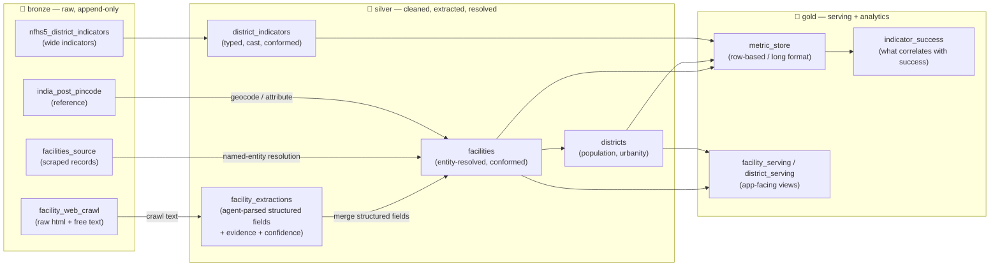

# Medallion Architecture & Metric Store Data Model

Governance, Integrity, & Facility Trust (GIFT) Desk recommends **where to place visiting surgical teams** across
India to close the surgical-care gap. The recommendation engine is only as good
as the data behind it, and the source data is **web-scraped, semi-structured,
and messy**. This document describes the data platform that turns that raw input
into trustworthy, queryable metrics:

1. A **medallion architecture** (`bronze → silver → gold`) on Databricks.
2. A **silver-layer crawl + Databricks-agent extraction** step that turns
   free-text facility websites into structured rows.
3. A **row-based (long-format) metric store** in gold — the same numbers the app
   shows today, but stored as one metric per row instead of one metric per
   column.
4. A gold **indicator/initiative → success** mart that scores which signals are
   most associated with closing the care gap.

> **Today vs. live.** The demo app generates a synthetic ~10K-record dataset in
> [`src/data.py`](../../src/data.py) and computes metrics at runtime in
> [`src/matching.py`](../../src/matching.py). This doc describes the **governed,
> production** shape of that same data on Databricks. The app's `load_bundle()`
> swaps from CSV to Databricks loaders with no change to the engine.

> **Naming.** Our Unity Catalog **catalog is `gift_india`**, with the medallion
> schemas `gift_india.bronze`, `gift_india.silver`, and `gift_india.gold` (the
> bare `bronze.`/`silver.`/`gold.` references below are all under the `gift_india`
> catalog). The continuously-synced serving tables land in the **Lakebase
> Postgres database `gift_india`** (Lakebase project `gift-india`). This is
> distinct from the upstream source — the Virtue Foundation listing
> `databricks_virtue_foundation_dataset_dais_2026` (schema `virtue_foundation_dataset`),
> which we read but do not rename.

---

## 1. Why medallion

The source data arrives in three very different states of cleanliness:

| Source | Shape | Problem |
|--------|-------|---------|
| Facility websites | Free text / HTML | Unstructured; specialties, beds, services buried in prose |
| Scraped facility records | Semi-structured | Duplicate entities, inconsistent names, missing fields |
| `nfhs_5_district_health_indicators` | Structured (wide) | One row per district, one column per indicator |
| `india_post_pincode_directory` | Structured | Reference data for geocoding / district attribution |

The medallion pattern gives each state of cleanliness its own home and a
one-directional promotion path. **Never read raw bronze from the app or API** —
serving reads gold only.



### Layer responsibilities

- **Bronze** — Land sources verbatim, append-only, source-native types. No
  business logic. Raw crawl HTML/text lives here so an extraction can always be
  re-run against the original bytes.
- **Silver** — Clean, type-cast, **extract free text into structured fields via
  a Databricks agent**, and **entity-resolve** duplicates to a single primary key
  with a `match_confidence` score. This is where messy becomes trustworthy.
- **Gold** — Conformed, query-optimized serving. Hosts the **row-based metric
  store** and the analytics marts the app and copilot read.

---

## 2. Silver: crawl facility websites → free text → structured data

This is the heart of the "Data Readiness Desk." Facility websites describe
specialties, bed counts, surgical volumes, and outreach **initiatives** in prose.
We need rows and columns.

### 2.1 Bronze: crawl and land the free text

A Python ingestion job (ingestion is the one place Python is allowed for data
work — transformations stay in dbt/SQL) crawls each facility's `website_url` and
appends the raw payload to `bronze.facility_web_crawl`.

| Column | Type | Notes |
|--------|------|-------|
| `crawl_id` | `string` (PK) | Hash of `website_url` + `crawled_at` |
| `facility_id` | `string` | Provisional link to source facility |
| `website_url` | `string` | Canonical web column name |
| `crawled_at` | `timestamp` | When the page was fetched |
| `http_status` | `int` | Crawl outcome |
| `raw_html` | `string` | Verbatim page |
| `raw_text` | `string` | Boilerplate-stripped **free text** |

> Bronze keeps source-native fidelity. The free text in `raw_text` is the input
> to the extraction agent — nothing is discarded, so extractions are replayable.

### 2.2 Silver: a Databricks agent parses free text into structure

The free text is parsed by a **Databricks agent** (Agent Bricks / a Model
Serving endpoint) invoked from the silver ingestion step. The agent reads
`raw_text` and emits a **structured JSON record per facility** plus, critically,
the **verbatim evidence span** that justified each field (so the extraction
obeys the "no fabricated data" rule and the UI can show *why* a value was
extracted).

Agent contract (illustrative output schema):

```json
{
  "facility_id": "VF-000123",
  "specialties": ["Cataract / Ophthalmology", "General Surgery"],
  "beds": 240,
  "annual_surgeries": 3100,
  "offers_surgery": true,
  "initiatives": ["free cataract camp", "rural outreach van"],
  "fields": [
    {
      "name": "annual_surgeries",
      "value": 3100,
      "confidence": 0.82,
      "evidence": "Our surgeons perform over 3,100 operations every year."
    }
  ]
}
```

The agent output lands in `silver.facility_extractions` (one row per extracted
field, carrying provenance):

| Column | Type | Notes |
|--------|------|-------|
| `extraction_id` | `string` (PK) | |
| `crawl_id` | `string` (FK → `bronze.facility_web_crawl`) | Provenance |
| `facility_id` | `string` (FK → `silver.facilities`) | |
| `field_name` | `string` | e.g. `annual_surgeries`, `specialties`, `initiative` |
| `field_value` | `string` | Stringified value (typed downstream) |
| `confidence` | `double` | Agent's extraction confidence `0–1` |
| `evidence_text` | `string` | **Verbatim** quote from `raw_text` |
| `model_version` | `string` | Endpoint / agent version for reproducibility |
| `extracted_at` | `timestamp` | |

### 2.3 Silver: conform + entity-resolve into `silver.facilities`

The extracted fields are merged with the scraped `facilities_source` records,
then **named-entity resolution** collapses duplicate facilities to a single
primary key with a `match_confidence` score. The resulting
`silver.facilities` mirrors the demo's facility frame (see `_generate_facilities`
in [`src/data.py`](../../src/data.py)): `facility_id`, `name`, `type`,
`district`, `state`, `lat`, `lon`, `beds`, `annual_surgeries`, `offers_surgery`,
`specialties`, `match_confidence`. Records below a confidence threshold (today
`< 0.70`, surfaced in the Data Readiness Desk tab) are flagged for review rather
than dropped.

---

## 3. The metric store: from columns to rows

### 3.1 The problem with wide columns

Today the engine computes per-district metrics as **wide columns** — one column
per metric, recomputed for whichever specialty is requested. From
[`src/matching.py`](../../src/matching.py):

```93:104:src/matching.py
    need_rate = NEED_PER_100K.get(request.specialty, DEFAULT_NEED_PER_100K)
    districts["estimated_annual_need"] = (
        districts["population"] / 100_000 * need_rate
    ).round().astype(int)
    districts["existing_capacity"] = (
        districts["district"].map(cap).fillna(0).round().astype(int)
    )
    districts["unmet_need"] = (
        (districts["estimated_annual_need"] - districts["existing_capacity"])
        .clip(lower=0)
        .astype(int)
    )
```

A wide layout (`estimated_annual_need`, `existing_capacity`, `unmet_need`,
`coverage_ratio`, `score`, …) is convenient for one query but rigid:

- **Adding a metric means a schema migration** (a new column everywhere).
- **The specialty dimension is trapped in runtime** — you can't store
  per-specialty values without a column explosion (`metric × specialty`).
- **No provenance per value** — a single row can't say *this number came from
  NFHS-5, that one from the engine, with this confidence, as of this date.*
- **Mixed sources don't compose** — facility-level, district-level, and
  state-level numbers can't sit in one table.

### 3.2 The row-based (long-format) metric store

The fix is to **pivot metrics from columns into rows**: one row per
`(entity, metric, dimension context, point in time)`. This is the gold
`metric_store`.

`gold.metric_store`:

| Column | Type | Notes |
|--------|------|-------|
| `metric_id` | `string` (PK) | Deterministic hash of the grain below |
| `entity_type` | `string` | `district` \| `facility` \| `state` |
| `entity_id` | `string` | District name/code, `facility_id`, or `state_code` |
| `state_code` | `string` | 2-letter code (alongside full `state`) |
| `state` | `string` | Full name |
| `specialty` | `string` | Dimension; `NULL` for specialty-agnostic metrics |
| `metric_name` | `string` | `estimated_annual_need`, `existing_capacity`, `unmet_need`, `coverage_ratio`, `priority_score`, … |
| `metric_value` | `double` | The number |
| `metric_unit` | `string` | `procedures_per_year` \| `ratio` \| `count` \| `score` |
| `as_of_date` | `date` | Point-in-time for trend/version |
| `source` | `string` | `engine` \| `nfhs5` \| `web_crawl` \| `census` |
| `confidence` | `double` | `0–1`; carried through from extraction / resolution |
| `evidence_ref` | `string` | FK to `facility_extractions.extraction_id` or source row |

> **Year storage.** Per the platform rule, any bare calendar year is stored as
> an `integer`; a real point-in-time (`as_of_date`) is a `date`. Serialize bare
> years as strings only at the JSON/API boundary.

### 3.3 The same five district metrics, pivoted

The wide district frame becomes rows like this. One district, one specialty:

| entity_type | entity_id | specialty | metric_name | metric_value | metric_unit | source | confidence |
|---|---|---|---|---|---|---|---|
| district | Koraput | Cataract / Ophthalmology | estimated_annual_need | 355 | procedures_per_year | engine | 1.00 |
| district | Koraput | Cataract / Ophthalmology | existing_capacity | 40 | procedures_per_year | web_crawl | 0.78 |
| district | Koraput | Cataract / Ophthalmology | unmet_need | 315 | procedures_per_year | engine | 0.78 |
| district | Koraput | Cataract / Ophthalmology | coverage_ratio | 0.11 | ratio | engine | 0.78 |
| district | Koraput | Cataract / Ophthalmology | priority_score | 0.74 | score | engine | 0.78 |

> The numbers above are **illustrative of the shape only**, not real warehouse
> values — they show how the wide columns map to rows. Real values come from the
> engine over governed data.

### 3.4 Why this is better

- **Add a metric without a migration** — just write new rows with a new
  `metric_name`.
- **Specialty becomes a first-class dimension** — store every
  `metric × specialty × district` combination, not just the one requested.
- **Provenance and confidence per value** — every number carries its `source`,
  `confidence`, and a pointer to its `evidence_ref`.
- **Sources compose** — facility-, district-, and state-grain metrics live in
  one table, filtered by `entity_type`.
- **Point-in-time and trends** — `as_of_date` lets you keep history and chart
  change over time.

### 3.5 Reading it back (wide-on-read)

The app still wants a wide row per district. Pivot **on read** in a gold serving
view instead of storing wide:

```sql
select
    entity_id                                                as district,
    state,
    specialty,
    max(metric_value) filter (where metric_name = 'estimated_annual_need') as estimated_annual_need,
    max(metric_value) filter (where metric_name = 'existing_capacity')     as existing_capacity,
    max(metric_value) filter (where metric_name = 'unmet_need')            as unmet_need,
    max(metric_value) filter (where metric_name = 'coverage_ratio')        as coverage_ratio,
    max(metric_value) filter (where metric_name = 'priority_score')        as priority_score
from gold.metric_store
where entity_type = 'district'
group by entity_id, state, specialty;
```

`load_bundle()` reads this view (or the equivalent gold serving table) and hands
the engine the same `districts` shape it expects today.

---

## 4. Which indicators / initiatives are best related to success?

The metric store makes it cheap to ask the planning question: **of all the
indicators we track and initiatives we extract, which ones actually move the
needle on closing the surgical-care gap?**

### 4.1 Define "success"

Pick an explicit, measurable success metric stored in the metric store, e.g.:

- **Coverage ratio** (`existing_capacity / estimated_annual_need`) — higher is
  better; or
- **Reduction in `unmet_need`** for a district over time (`as_of_date` trend).

### 4.2 Assemble the feature set

For each district (and specialty), gather candidate signals already in the store
or joinable to it:

- **NFHS-5 district health indicators** (`source = 'nfhs5'`) — institutional
  delivery rate, anaemia prevalence, immunization coverage, etc.
- **Facility-derived attributes** rolled up from `silver.facilities`
  (`offers_surgery` density, bed capacity, facility-type mix).
- **Initiatives** extracted by the agent from free text (`field_name =
  'initiative'` in `silver.facility_extractions`) — "free cataract camp,"
  "rural outreach van," "telemedicine clinic," etc., one-hot encoded per
  district.

### 4.3 Score the association → `gold.indicator_success`

A dbt + (Python ML for the modeling step only) job correlates each indicator /
initiative against the success metric and writes the result back as rows:

`gold.indicator_success`:

| Column | Type | Notes |
|--------|------|-------|
| `indicator_id` | `string` (PK) | |
| `indicator_name` | `string` | NFHS indicator or extracted initiative |
| `indicator_kind` | `string` | `health_indicator` \| `initiative` \| `facility_attribute` |
| `success_metric` | `string` | e.g. `coverage_ratio` |
| `specialty` | `string` | Dimension; `NULL` = all |
| `association` | `double` | Correlation / standardized effect size |
| `feature_importance` | `double` | From the fitted model (e.g. permutation importance) |
| `n_districts` | `int` | Support behind the estimate |
| `as_of_date` | `date` | |

The copilot and planner can then surface, per specialty, the ranked initiatives
and indicators most associated with success — turning "where to send a team"
into "*and which programs to pair with the visit.*"

> **No fabricated data.** Every association is computed over real governed data
> with a stated support (`n_districts`). Where support is too thin or data is
> missing, surface an explicit empty/unavailable state — never a made-up
> coefficient.

---

## 5. Mapping to today's code

| Concept in this doc | Demo today | Live (Databricks) |
|---------------------|-----------|-------------------|
| Bronze sources | n/a (synthetic) | `virtue_foundation_dataset.facilities`, `nfhs_5_district_health_indicators`, `india_post_pincode_directory` |
| Crawl free text | n/a | `bronze.facility_web_crawl` ingestion job |
| Agent extraction | n/a | Databricks agent → `silver.facility_extractions` |
| Entity resolution + `match_confidence` | `_generate_facilities()` in [`src/data.py`](../../src/data.py) | `silver.facilities` |
| Wide district metrics | `rank_districts()` in [`src/matching.py`](../../src/matching.py) | rows in `gold.metric_store` |
| Wide-on-read for the app | `bundle.districts` columns | `gold` serving view → `load_bundle()` |
| Indicator/initiative ranking | n/a | `gold.indicator_success` |

To go live, implement Databricks loaders in `load_bundle()` (via
`databricks-sql-connector` or the Databricks SDK) that read the gold serving
views and return the same `facilities` / `districts` shape the engine expects.
The matching engine, copilot, and UI do not change.
